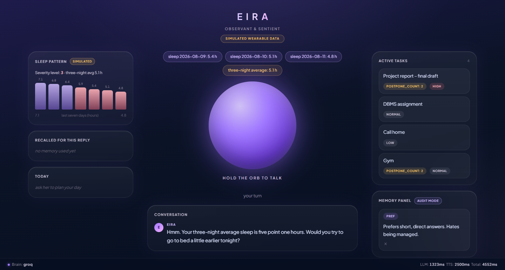
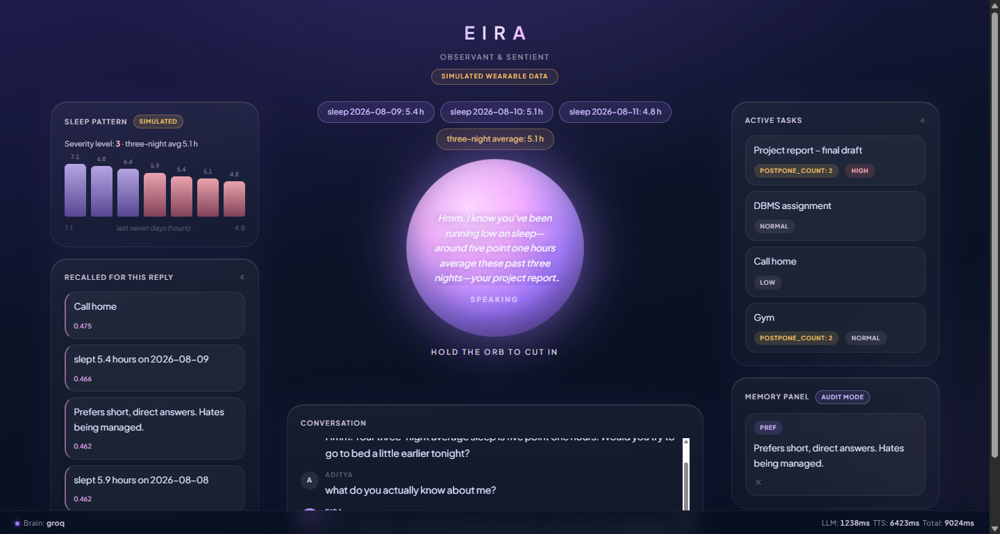
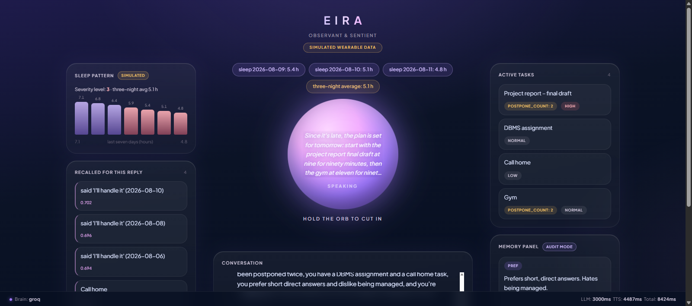

# EIRA — Emotionally Intelligent Real-time Agent

**A voice companion that notices the person behind the tasks.**
She remembers across sessions, spots burnout patterns *with evidence*, and
renegotiates your day out loud — then drops a subject for good when you ask her to.

Built for **StarForge 2026 · VoxForge track**.
Voice by **Rime Coda** · memory by **Qdrant** · reasoning by **Groq + Gemini**.



---

## The idea

Most assistants wait to be asked. EIRA opens the conversation, because she already
looked at your week:

> *"Hmm. Your three-night average sleep is five point one hours. Would you try to
> go to bed a little earlier tonight?"*

Nobody prompted that. A pattern engine scanned her stored memory at session start,
found three consecutive nights under six hours, and handed her one piece of
evidence to raise — gently, once.

Every claim she makes is backed by a **receipt** shown in the interface. She never
says "you seem tired"; she says "three nights under six hours" and shows you the
row it came from.

## Three things worth looking at

### 1. Memory that visibly changes the answer

The left rail shows **exactly which stored memories were retrieved for the reply
you just heard**, with their similarity scores. Not a claim that memory matters —
the actual vectors that shaped the sentence.



### 2. A consent ladder she actually obeys

Observe → mention once → suggest → act only on a yes. Deflections get a two-beat
response, never a one-beat brush-off:

| you say | she says |
|---|---|
| "yeah yeah I'll handle it" | *"Mmhm. That's the fourth time this week you've said you'll handle it."* |
| "seriously, I've got it" | *"Haha, okay... I believe you."* |

The receipt comes first, the warm yield only after you push back a second time.
Say **"stop asking about the gym"** and a suppression is written to the vector
store — she will not raise it again in this session or any future one, because the
refusal is *data*, not a flag in memory.

### 3. A plan that respects the clock

Ask her to plan your day and she orders tasks by what your week actually shows —
avoided work front-loaded, the schedule trimmed when you are short on sleep. Ask
after midnight and the plan rolls to tomorrow, and she says so.



---

## Architecture

```
Browser  ── push-to-talk (Web Speech API), barge-in, audio-reactive orb
   │  transcript
   ▼
FastAPI ──► Qdrant Cloud     memory: tasks · preferences · pattern logs
        ──► Pattern Engine   R1 sleep · R2 postponed · R3 deflection
        ──► LLM              Groq chain ⇄ Gemini key pool (auto-failover)
        ──► Rime Coda TTS    HTTP synthesis, voice: nadi
   ▼
mp3 + receipts + recalled memories + board + day plan
```

Deliberately no LiveKit, no WebSockets, no agent framework. Request/response and
half-duplex, with barge-in handled client-side — the whole system is ~1,100 lines
you can read in one sitting.

**Barge-in:** press the orb while she's talking and she stops, works out how much
of the sentence you actually heard, and continues from there instead of repeating
herself.

## Run it

```bash
pip install -r requirements.txt
cp .env.example .env            # add your five keys

python scripts/pick_voice.py    # shortlists Rime voices → set RIME_SPEAKER
python scripts/test_rime.py     # proves TTS works
python scripts/test_qdrant.py   # proves memory + tenant isolation
python scripts/seed_data.py     # loads the synthetic demo week

uvicorn main:app --app-dir backend --port 8000
```

Open <http://127.0.0.1:8000> in Chrome and hold the orb to talk.
Re-run `seed_data.py` to reset the demo (it also rolls the dates so "last night"
is always accurate).

Keys needed: [Rime](https://app.rime.ai/tokens) ·
[Qdrant Cloud](https://cloud.qdrant.io) (free tier) ·
[Groq](https://console.groq.com/keys) ·
[Gemini](https://aistudio.google.com/apikey).

## Engineering decisions worth defending

**Memory is multi-tenant by construction.** One Qdrant collection with payload
partitioning, `user_id` indexed as a tenant keyword (`is_tenant=True`) per
Qdrant's own multitenancy guidance. Every search, scroll, payload update and
delete carries the user filter — there is no code path that queries without it.
`test_qdrant.py` asserts a different `user_id` retrieves nothing. Embeddings use
the `models.Document` FastEmbed pattern at both write and query, so there is no
hand-rolled encoding step to drift out of sync.

**Two providers, and the failover is not theoretical.** The Groq chain walks
sibling models (each has its own daily token budget) before falling through to a
rotating pool of Gemini keys; either provider failing is invisible to the user.
During the build Gemini retired a model mid-session, then hit quota, then went
into a high-demand degradation — and no turn was ever dropped. Every reply reports
which brain answered, in the status bar.

**Warmth is prompt engineering, not an API feature.** Rime Coda exposes no emotion
tags: delivery comes only from wording and punctuation. So the persona rations
address terms (constant use reads as a verbal tic), names the reactive sounds the
engine renders correctly (`hmm`, `mmhm`, `haha`, `nah`, `alright`), and places the
beat precisely — `Haha, okay... I believe you` lands as affection where
`Haha, alright. I believe you.` lands as mockery. That distinction was found by
ear and encoded as a rule.

**Nothing numeric reaches the engine as a digit.** The persona writes every number
as spoken words, and `sanitize_for_speech` logs a warning if one slips through, so
the fix lands in the prompt rather than in a regex patch.

**The model cannot invent capabilities.** Every action is registered in an
executor table; anything outside it is refused and logged, so a hallucinated tool
call degrades to a normal turn instead of an error.

## Limitations, stated plainly

- **Wearable data is simulated** (`data/wearable_sim.json`), badged as such in the
  interface. HealthKit / Google Fit integration is roadmap, not built.
- **Emotion is inferred from language and behaviour**, not from voice prosody.
  No acoustic stress analysis is performed, despite what a voice demo might imply.
- **Single-user demo.** The isolation mechanism is real and tested; the demo drives
  one tenant.
- **Speech recognition is the browser's**, so accuracy varies with microphone and
  accent. Chrome only.
- **Latency depends on free-tier providers.** Typical turns land in three to six
  seconds; provider rate limits can occasionally stretch that.

## Security and data handling

API keys are server-side only and never reach the browser — the frontend talks
only to this backend. `.env` is gitignored and `.env.example` ships with empty
placeholders. All demo content is synthetic: no real personal data appears in
prompts, logs, screenshots, or this repository.

## Credits

Built by [Aditya Sharma](https://github.com/SPKaditya).

Developed with **Claude Code** (Anthropic) as a pair-programming assistant, used
for implementation, debugging, and prompt iteration; all architecture and design
decisions, the persona calibration, and every delivery judgement were made and
verified by the author. The interface design system originated in a
[Google Stitch](https://stitch.withgoogle.com) concept and was rebuilt by hand as
a single self-contained page wired to the live backend.

Licensed under the [MIT License](LICENSE).
